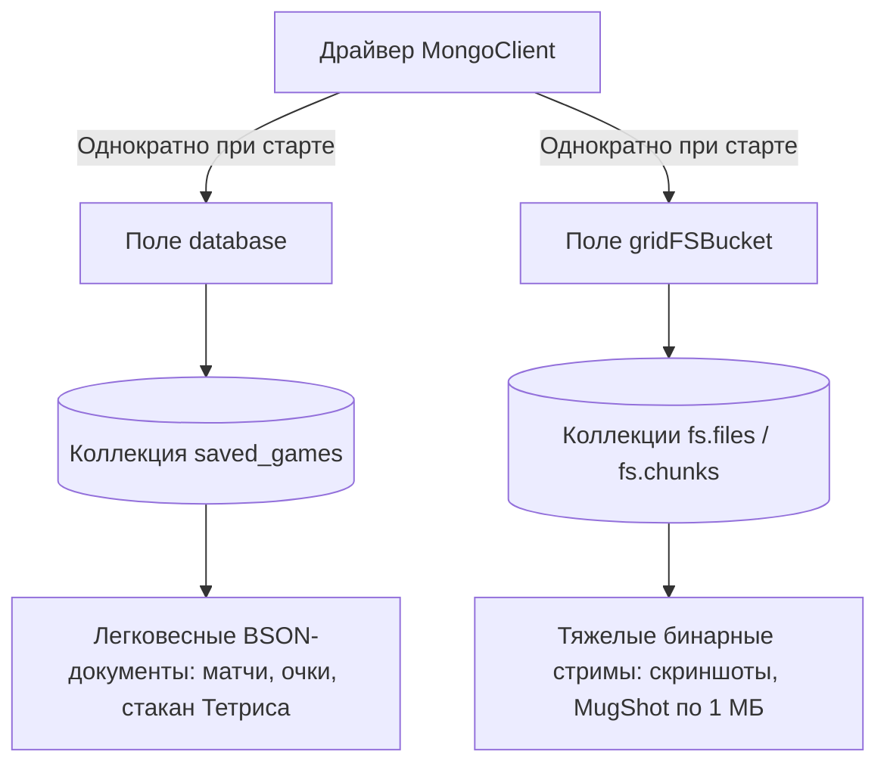

# Mongo-microservice (mongo-service)

Микросервис синхронной и асинхронной обработки и записи неструктурированных данных на базе **MongoDB**. Сервис отвечает за надежное сохранение и восстановление слепков (дампов) текущих матчей Тетриса, а также за управление графическим контентом: игровыми скриншотами и профильными фотографиями игроков (MugShot).

## 🛠️ Стек технологий и особенности

* **Язык и производительность:** Java 21 со включенными виртуальными потоками (Virtual Threads). Нативная поддержка Лумов активирована для Tomcat, а gRPC-сервер переведен на виртуальные потоки через кастомный `GrpcServerConfigurer`. Это гарантирует максимальную пропускную способность при передаче тяжелых массивов байт без пиннинга потоков-носителей (`-Djdk.tracePinnedThreads=short` проверен).
* **Фреймворк:** Spring Boot 3.4.2 + Spring Cloud 2024.0.0 (Netflix Eureka Client).
* **База данных:** MongoDB, подключенная через высокоуровневый стартер `spring-boot-starter-data-mongodb`.
* **Технология хранения файлов (GridFS):** Графические файлы большого размера (скриншоты и фото) сохраняются через `GridFSBucket`, который автоматически разбивает бинарные данные на чанки размером 1 МБ (`1048576 bytes`).
* **Атомарные операции (Upsert):** Состояние прерванных матчей сериализуется в BSON через Google `Gson` и сохраняется в коллекцию `saved_games` с помощью атомарного метода `replaceOne` с флагом `upsert(true)`. Это исключает конфликты параллельной записи и избыточные удаления.
* **Высокопроизводительное кэширование:** Локальный кэш Caffeine для моментальной отдачи структуры сохраненных игр и бинарных данных картинок без повторного чтения с диска.

## 🔀 Сетевые интерфейсы и Порты

Микросервис использует гибридную архитектуру сетевого взаимодействия:

* **HTTP Порт (3333):** Предназначен для административных REST-запросов от API Gateway. Включена настройка `prefer-ip-address=true` для стабильной маршрутизации внутри Docker.
* **gRPC Порт (6565):** Выделенный канал для высокоскоростной передачи тяжелых стримов и файлов из игрового движка. Порт динамически публикуется в метаданных реестра Эврики.

## 🔌 API Endpoints (HTTP REST)

Все административные методы работают в неблокирующем режиме через асинхронный запуск `CompletableFuture.runAsync` поверх выделенного пула виртуальных потоков `virtualThreadExecutor`, моментально освобождая HTTP-потоки шлюза:
* `DELETE /delete?playerName={имя}` — Запускает асинхронную очистку прерванной игры конкретного пользователя.
* `DELETE /delete_image?playerName={имя}&fileName={файл}` — Точечное асинхронное удаление графического снимка матча из хранилища GridFS.
* `POST /prepare?playerName={имя}` — Проверяет наличие изображений игрока в БД. Если файлов нет, считывает стандартные картинки-заглушки из папки ресурсов и асинхронно инициализирует файловое окружение для нового пользователя.

## 💾 Стратегия хранения данных в MongoDB

Внутри репозитория `DaoMongo` реализовано жесткое разделение обязанностей между документоориентированным движком базы данных и файловой системой GridFS. Для исключения накладных расходов при высоком RPS и лавине виртуальных потоков Loom, соединения с базой и бакетом инициализируются **строго один раз при старте микросервиса** (`@PostConstruct`) и кэшируются в потокобезопасных полях класса (`database` и `gridFSBucket`), полностью избавляя JVM от лишних аллокаций памяти.

### 1. Поле `database` — Для игровых состояний (BSON)
Используется для работы со стандартными коллекциями MongoDB (в частности, `saved_games`).
* **Что хранит:** Структуру игрового стакана `char[][]`, очки и имя игрока, сериализованные через Google `Gson` в монолитный BSON.
* **Почему так:** Данные матча весят всего несколько килобайт. Они идеально укладываются в концепцию единого атомарного документа и обновляются на лету.

#### 💎 Механика и преимущества атомарного Upsert (`replaceOne`)
Сохранение состояния стакана Тетриса и счета игрока реализовано через атомарный метод `replaceOne` с флагом `upsert(true)`. Это инженерное решение закрывает сразу три критические задачи:

* **Концепция единого атомарного документа (Защита от сбоев):** В отличие от реляционных баз данных (SQL), где для сохранения ячеек стакана и счета пришлось бы делать каскад мелких запросов `INSERT` в связанные таблицы, здесь всё состояние матча (`SavedGame`) сериализуется в один документ. Драйвер гарантирует атомарность на уровне документа: он либо запишется целиком, либо не запишется вовсе. Ситуация, при которой из-за сбоя сети счет сохранился, а стакан пропал, физически невозможна.
* **Исключение гонки данных (Race Condition):** Флаг `upsert(true)` (Update + Insert) избавляет Java-код от лишних ручных проверок в стиле `if (играСуществует) { update } else { insert }`. Такой подход в многопоточной среде неизбежно приводил бы к конфликтам параллельных потоков и ошибкам `Duplicate Key Exception`. Команда `replaceOne` выполняет проверку и замену на стороне MongoDB атомарно, мгновенно изолируя конкурентные запросы.
* **Защита от фрагментации диска:** Постоянное изменение и перезапись документов разного размера в MongoDB приводит к фрагментации файловой системы (база начинает двигать данные по диску, снижая скорость I/O). Однако структура стакана Тетриса имеет фиксированный и экстремально маленький размер. При вызове `replaceOne` обновленный JSON идеально вписывается в те же физические байты на диске, которые занимал старый документ, сохраняя диск ровным, а скорость чтения — максимальной.

### 2. Поле `gridFSBucket` — Для медиа-контента (GridFS)
Используется как виртуальная файловая система поверх системных коллекций `fs.files` (метаданные) и `fs.chunks` (бинарные куски). Потокобезопасный инстанс бакета переиспользуется всеми потоками Loom параллельно.
* **Что хранит:** Тяжелые массивы байт (`byte[]`) — аватарки (`MugShot`) и снимки экранов матчей.
* **Почему так:** Вместо загрузки файла целиком в RAM, GridFS автоматически нарезает графику на фиксированные чанки размером 1 МБ (`1048576 bytes`). Это позволяет виртуальным потокам Java 21 читать и писать файлы потоками (`InputStream`/`OutputStream`) в режиме неблокирующего конвейера, полностью защищая микросервис от утечек памяти (`OutOfMemoryError`) при массовой одновременной загрузке скриншотов.

## 🛰️ Контракт gRPC Сервиса (SnapshotService)

Внутренний интерфейс взаимодействия, описанный в Protobuf, предоставляет игровому движку следующие RPC-методы, каждый из которых обрабатывается в изолированном виртуальном потоке:

1. **Работа с графикой:**
   * `UploadSnapShot` — Принимает бинарный массив (`bytes`) скриншота игрового поля и сохраняет его в GridFS.
   * `UploadMugShot` — Принимает и сохраняет аватарку/профильное фото игрока.
   * `DownloadBytes` — Высокоскоростное скачивание бинарного файла из MongoDB по имени игрока и названию файла.
2. **Управление состоянием игры:**
   * `SaveGame` — Фиксирует слепок текущего матча. Трансформирует список строк игрового поля Тетриса (`repeated string`) в двумерный массив символов `char[][]` (структуру игрового стакана) и сохраняет ее в MongoDB.
   * `GetSavedGame` — Производит обратную конвертацию: находит сохраненную сессию, собирает массив символов обратно в строки и возвращает полное состояние матча для возобновления игры.

## ⚡ Оптимизированное кэширование (Caffeine)

Конфигурация кэша ограничена 1000 записей со временем жизни в 15 минут (`mongo-server.properties`). Реализована сквозная автоматическая синхронизация данных:

* **`items_list`** — Активная область горячих данных игрового процесса:
    * Состояние игры кэшируется по ключу `{playerName}_save`. Метод сохранения использует стратегию **`@CachePut`** (с изменением сигнатуры на возврат объекта), что обновляет кэш на лету и полностью исключает промахи кэша (`cache miss`) и лишние запросы на чтение к MongoDB.
    * Массивы байт картинок кэшируются по составному ключу `{playerName}{fileName}_img`. При подготовке профиля создаются дефолтные заглушки, которые точечно инвалидируются с помощью **`@CacheEvict`** в момент загрузки реального аватара или скриншота через gRPC. Это предотвращает залипание старой графики в памяти.

### 🧠 Обоснование стратегий кэширования (RAM Optimization)

В микросервисе применены две принципиально разные стратегии управления памятью Caffeine в зависимости от объема и специфики передаваемых данных:

1. **Легковесные данные матчей (`SavedGame`) — Стратегия `@CachePut`**
    * **Механика:** При сохранении состояния стакана Тетриса метод `loadSavedGameIntoMongodb` возвращает сохраненный объект, и Spring принудительно перезаписывает его в кэше.
    * **Обоснование:** Структура текстового BSON-документа игры весит всего 1–2 Килобайта. Хранение 1000 таких записей в RAM занимает не более 2 Мегабайт, что абсолютно безопасно для сервера. Это делает кэш всегда «горячим» и полностью разгружает коллекцию `saved_games` MongoDB от повторных запросов на чтение (`find`).

2. **Тяжелые бинарные медиа-файлы (`byte[]`) — Стратегия `@CacheEvict`**
    * **Механика:** При аплоуде скриншотов или аватарок методы `loadSnapShotIntoMongodb` и `loadMugShotIntoMongodb` возвращают `void` и используют `@CacheEvict` для точечного удаления старых ключей из памяти, оставляя кэш пустым. Новый файл пишется напрямую на диск в GridFS.
    * **Обоснование:** Графический `.jpg` файл весит в среднем 100–300 Килобайт. Принудительное кэширование всех загружаемых картинок через `@CachePut` мгновенно забило бы оперативную память сервера (сотни Мегабайт при массовой игре) и привело бы к ошибке `OutOfMemoryError`.
    * **Результат:** Память RAM экономится. Новая картинка попадет в кэш Caffeine только по требованию (в момент реального просмотра через `@Cacheable`), а невостребованная графика спокойно лежит на диске, не нагружая сборщик мусора (Garbage Collector).

## 🚀 Запуск проекта

### Требования
* Установленный JDK 21
* Запущенный инстанс MongoDB (настройки по умолчанию: `mongodb://localhost:27017/shopDB`)
* Активный `Eureka-microservice` на порту 1111

### Порядок запуска
1. Перейти в каталог проекта `Mongo-microservice`.
2. Скомпилировать проект и сгенерировать gRPC стабы: `mvn clean compile`.
3. Запустить приложение. Микросервис автоматически подхватит конфигурацию `GrpcLoomConfig` и развернет файловую инфраструктуру.
